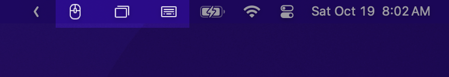

# Swift Scripts - MacOS Swift Utilities

> ⚠️ **Project Archived**
>
> This project was an experiment in utilizing Swift as a scripting language for MacOS native APIs. While the concept showed promise, I encountered significant challenges in creating a seamless distribution and installation process, which ultimately conflicted with my goal of providing easily accessible utilities. As a result, I've decided to archive this project for now.

This repository is a collection of Swift scripts designed to enhance functionality on MacOS machines. These scripts aim to replace many application-based utilities with simple, efficient, and customizable command-line tools.

## Overview



The project currently includes the following utilities:

- Window Manager (`window-manager.swift`): Manages window positioning and sizing.
- Scroll Reverser (`scroll-reverser.swift`): Customizes scroll behavior for mouse and trackpad.
- Key Binds (`key-binds.swift`): Implements custom key bindings for enhanced productivity.

Additional utility scripts and snippets are available in the `snippets` directory.


## Installation

No installation is required. Simply clone the repository to your local machine:

```bash
git clone https://github.com/jonfriesen/swift-scripts.git
```

## Usage

Before running any script, make it executable using the following command:

```bash
chmod +x script_name.swift
```

Then, you can run the script directly:

```bash
./script_name.swift
```

Alternatively, these scripts can be compiled to binary and run without the need for a Swift interpreter.

```bash
swiftc -O -o window-manager window-manager.swift
./window-manager
```

# Example:

```bash
chmod +x window-manager.swift
./window-manager.swift
```

Each script includes a header with specific usage instructions and features. Please refer to the individual script files for detailed information.

## License

This project is licensed under a Modified MIT License. Please see the [LICENSE](LICENSE) file for details. Key points:

- The software is free to use for personal, non-commercial purposes.
- Distribution and commercial use are not permitted.
- The license and copyright notice must be included with all copies of the software.

## Contributing

Contributions to enhance existing scripts or add new ones are welcome. Please follow these guidelines:

1. Ensure your script is simple and easy to use.
2. Include the standard header (found in `snippets/header`) at the top of new scripts.
3. Abide by the terms of the [LICENSE](LICENSE).
4. Open an issue to discuss major changes before submitting a pull request.
5. Submit a pull request with a clear description of your changes or additions.

## Disclaimer

These scripts may require accessibility permissions to function correctly. Use them at your own risk and always review the code before running it on your system.
